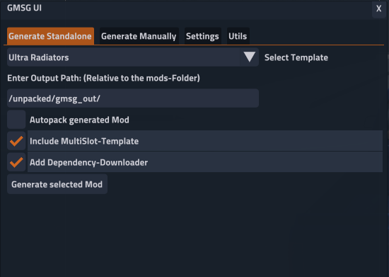
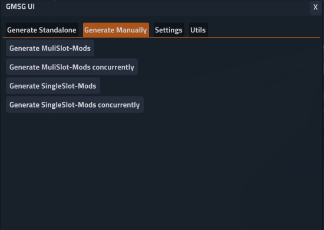
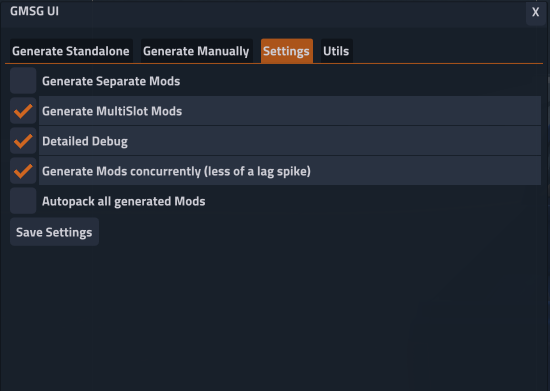
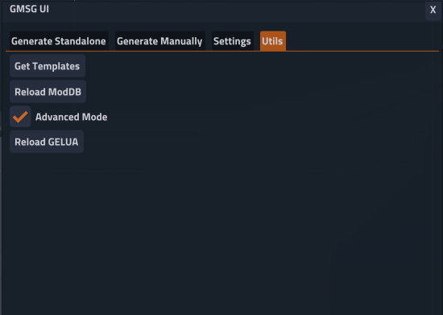

# General Modslot Generator / MultiSlot for BeamNG
This Mod aims to add a simple way to make "Additional Modification" - Mods for BeamNG, that automatically get generated for every installed vehicle ingame, even modded ones.

You only need to add a Json-Template to ```/modslotgenerator/``` for a mod and it generates everything based on the Settings in the UI.  
It also adds "MultiSlot" compatibility, so you can use multiple "Additional Modification" - mods at the same time.  
[More Info](https://toemmsen.ch/posts/multislot/)
### App (old, abandoned)

<details>
<summary>Description:</summary>

A simple to the UI addable app to generate all the mods manually or generate a specific one by entering your templates location.  
Can also generate everything as a separate, non Mulislot mod.  

</details>

### Imgui-Lua app / popup menu (new)
- Generate Standalone mods with specified output, automatic packing etc
- Generate Manually (MultiSlot and Standalone)
- Settings for generator: Autopack, Separate Mods, Debug level , Concurrency
- Utils: Get Templates (to see what Templates get detected), reload ModDB, reload Lua
- Editable Keybind in the Settings to open and close
- UI Button that can be added to open and close app
- Draggable and resizable
<details>
<summary> Pictures: </summary>







</details>

## Plugins
- [My Plugins (GitHub)](https://github.com/Toemmsen96/MultiSlotPlugins)
- Advanced Internals by [wlkmanist](https://www.beamng.com/members/wlkmanist.529857/):
    - https://www.beamng.com/resources/advanced-internals.26605/

## TODO
<details>
<summary>Current todo list:</summary>

- [ ] Automatically create a Body with a Mod slot for non modslot vehicles, or sovle the issue otherwise, maybe Plate-Slot.
- [ ] Compatibility to MultiSlot for all Mod-Slot-mods  
- [ ] Tutorial on creating Plugins for this
- [ ] Change Menu-Setting to Debug-Level instead of Detailed Debug toggle
- [ ]  (Later maybe) Add Editor tab, to make Templates inside BeamNG
</details>


